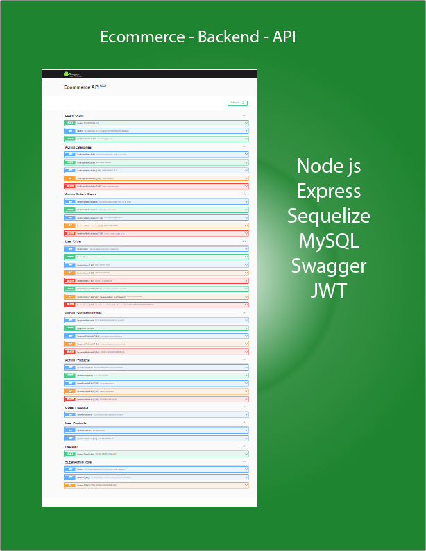
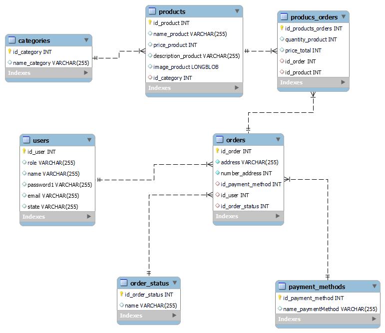

## Backend de una tienda Ecommerce

<details>
<summary>Backlog</summary>

- [x] El email no debe estar repetido.
- [x] El email debe contener @.
- [x] La password debe tener mas de 8 caracteres y menos que 15, debe tener almenos un numero, un caracter y una mayuscula.
- [x] Los metodos de pago seran un string indicando a cual hace referencia, la implementacion de comprobacion requiere Frontend.
- [x] Los estados de las ordenes seran ( PENDIENTE - ORDEN RECIBIDA - ARMANDO - ENVIANDO)
- [x] Solo se podra modificar cuando la orden esten en PENDIENTE
- [x] Deben existir 3 roles → Super Admin, Admin, User
      Como SuperAdmin:
- [x] Los datos del SUPERADMIN deben ser entregados por el Desarrollador
- [x] Debe contar con middleware que compruebe existencia de token.
- [x] Debe contar con middleware que compruebe que el token tenga role de SuperAdmin.
- [x] Debe contar con middleware que compruebe que el id ingresado sea el correspondiente.
      Como Admin:
- [x] El usuario ADMIN debe poder [ CRUD ] productos.
- [x] Debe tener middleware que compruebe existencia de token.
- [x] Debe tener middleware que comprueba token de role admin.
- [x] Debe tener middleware que compruebe que el nombre de producto ya esta en base de datos.
- [x] Puede [CRUD] categorias.
- [x] Las categorias no pueden estar repetidas.
      Como Usuario:
- [x] Debe estar online para habilitar ordenes.
- [x] El usuario debe poder deslogearse.
- [x] Puede ver los productos de la tienda.
- [x] Puede ver sus ordenes de compra.
- [x] Puede ver sus datos personales.
- [x] Puede CRUD ordenes de compra.
- [x] El usuario podra ELIMIINAR una orden si el producto aun esta "PENDIENTE".
- [x] El usuario prodra EDITAR una orden si esta en estado "PENDIENTE".
- [x] los productos deben tener querys/filtros:
  - [x] por paginas
  - [x] por numero de elementos
  - [x] por categoria

<br>
</details>

<details>
<summary>Instalacion</summary>

1. Clonar o descargar el repositorio.
2. Instalar las dependencias con el comando `npm install`
3. Crear una base de datos llamada: ecommerce_api
4. Crear un archivo `.env` en la raiz de la carpeta
   Pegar el siguiente codigo y completar

```
// SERVER
PORT_SERVER=4005

// BASE DE DATOS
DB_NAME=ecommerce_api
DB_USER="ingresar usuario"
DB_PASSWORD="ingresar password"
DB_HOST=localhost
DB_PORT=3306

// JWT
SECRET_TOKEN=secreto
```

5. Importar en base de datos el archivo que esta en la carpeta `sql/files`
   Este trae datos cargados por defecto.
   <br>
   Usuario: ID = 1 ; Email = superadmin@gmail.com ; Password = $EcommerceSuperAdmin1
   <br>
   Usuario: ID = 2 ; Email = admin@gmail.com ; Password = $EcommerceAdmin1
   <br>
   Usuario: ID = 3 ; Email = user@gmail.com ; Password = $EcommerceUser1
   <br>
   Tambien trae cargado los estados -> PENDIENTE - ORDEN RECIBIDA - ARMANDO - ENVIANDO.
   El usuario con rol "SuperAdmin" solo lo puede generar el desarrollador modifcando la tabla "users".
   Con esto se logra que ese rol sea el unico que puede generar usuarios "admin".
6. Iniciar el servidor con el comando npm run dev
   En consola saldra el path del server y de la documentacion.

<br>
</details>

<details>
<summary>Imagen Swagger</summary>



<br>
</details>

<details>
<summary>Imagen DER</summary>



<br>
</details>
